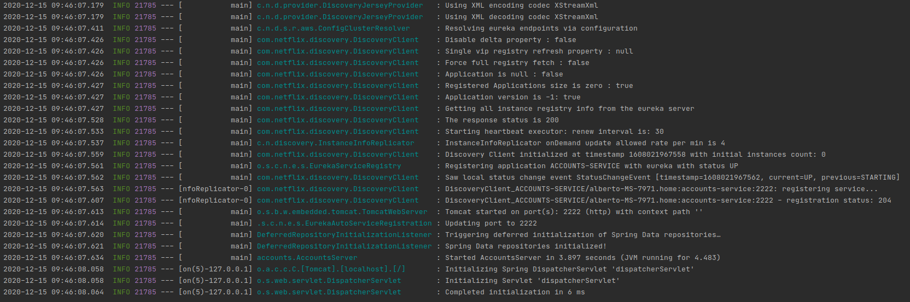
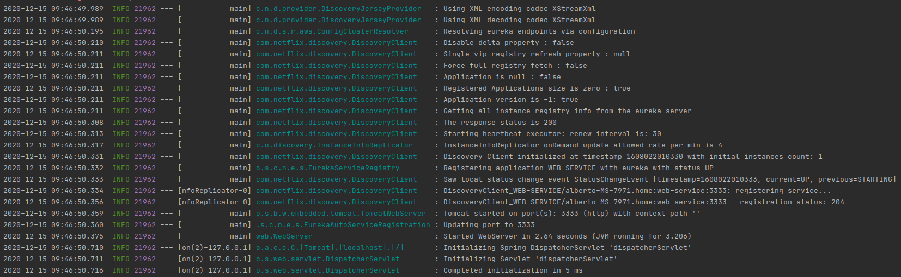
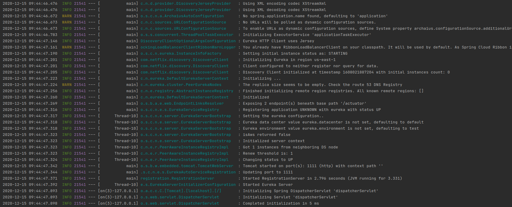
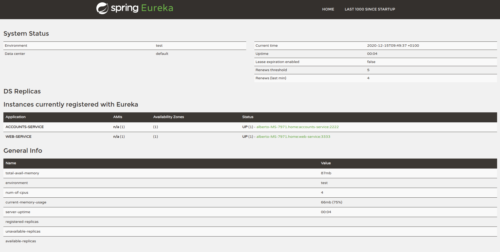
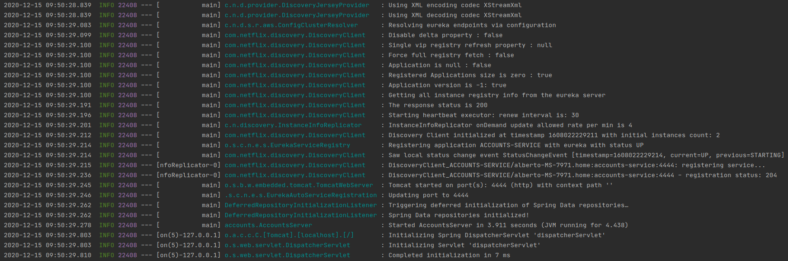
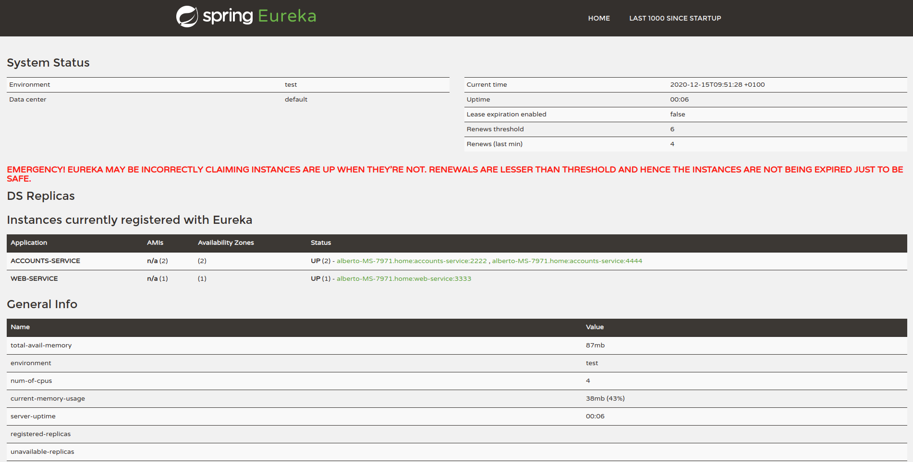

- The two microservices accounts (2222) and web are running and registered (two terminals, logs screenshots)
    - Accounts(Port 2222)
      
    - Web
      

- The service registration service has these two microservices registered (a third terminal, dashboard screenshots)
    - Registration launched
      
    - Registration dashboard
      

- A second accounts microservice instance is started and will use the port 4444. This second accounts (4444) is also registered (a fourth terminal, log screenshots).
    - Accounts(Port 4444)
      
    - Dashboard with new accounts service
      

- What happens when you kill the microservice accounts (2222) and do requests to web? Can the web service provide information about the accounts again? Why?
    - It dissapear from the registration dashboard. As there is another accounts service registered, the web service still provide information about the accounts using that second accounts service. This is an advantage of service discovery and replication.
